<br/>
<br/>
<p align="center">
  <a href="https://github.com/smarthane/flutter_starter">
    
  </a>
  <h3 align="center">Flutter Starter</h3>
  <p align="center">
    🔥👍基于fish_redux的纯flutter快速开发框架。框架集成黑夜模式、多色彩主题、国际化、切换字体、优美动画，以及各种常见的、丰富的开发示例。可以让你快速的上手开发一个移动应用APP(Android\iOS)。希望和大家共同成长，喜欢的话，欢迎start或fork!
    <br/>
    <br/>
    <br/>
  </p>
</p>

### :cat: 0、【Flutter Starter】
- github:[https://github.com/smarthane/flutter_starter](https://github.com/smarthane/flutter_starter)
  <br/>
- gitee:[https://gitee.com/smarthane/flutter_starter](https://gitee.com/smarthane/flutter_starter)
  <br/>
- 如README.md中的图片在github中显示不出来，可以查看gitee，两个仓库代码已经同步！！！
- 此工程为纯flutter开发框架，如项目想进行混合开发达到与原生工程完全解耦(目前只支持安卓打包成aar方案,iOS的pod方式依赖后面也会支持！)，可以参考本人开源的另外一个项目[flutter_component](https://github.com/smarthane/flutter_component)：（一个将
  Flutter 工程打包成 aar
  的组件化工程，让安卓原生工程可以进行快速的flutter混合开发。）

| 扫码下载 |
| :----:|
||

### :computer: 一、【项目介绍】

- 当前代码的Flutter SDK 版本：1.17.3-stable（flutter SDK >= 1.17.3-stable目前都支持建议可以用最新的SDK版本）。
- 项目整体结构以及状态管理使用Fish Redux（action、effect、page、reducer、state、view），Fish Redux 是一个基于 Redux 数据管理的组装式 flutter 应用框架， 它特别适用于构建中大型的复杂应用。Redux 是一个专注于状态管理的框架，Fish Redux 是基于 Redux 做状态管理的应用框架。应用框架不仅仅要解决状态管理的问题，还要解决分治，通信，数据驱动，解耦等等问题。
- 项目国际化方案使用flutter_intl方案（需要AS安装Flutter Intl插件）。
- 框架中网络请求数据包含wanAndroid已开放API的功能:项目、博文、公众号、导航等,是一个超完整的学习App。
- 代码支持安卓和iOS，完善的注释和踩坑记录，非常适合Flutter学习。
- 包含丰富的flutter开发示例、易用美丽的界面UI。

### :house: 二、【架构图】

| Fish Redux Architecture | Flutter Starter Architecture |
| :----: |:----: |
| 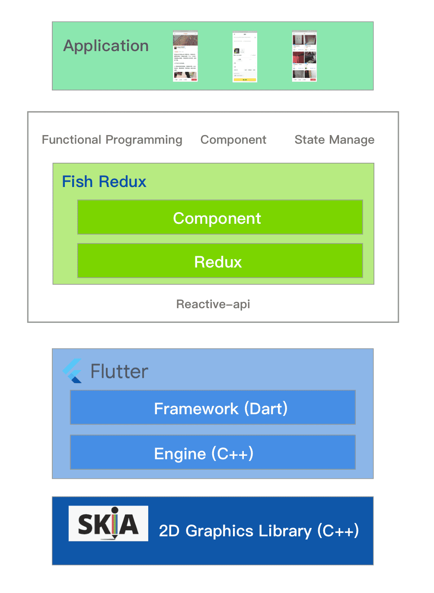|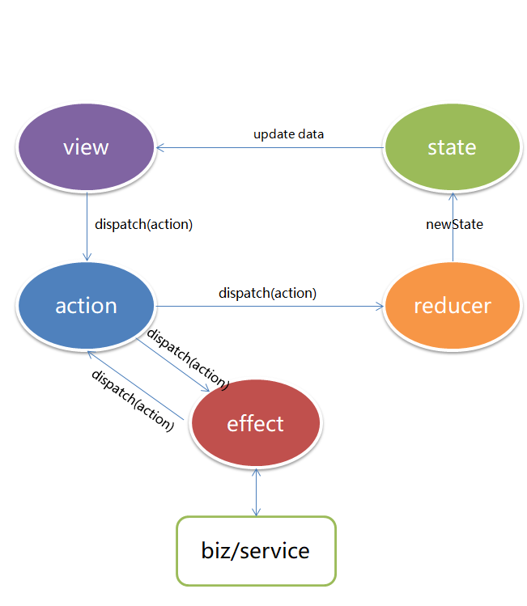|

### :computer: 三、【应用截图】
| 启动页动画 | 登录注册页 | 黑夜模式 |
| :----: | :----: |:----: |
| 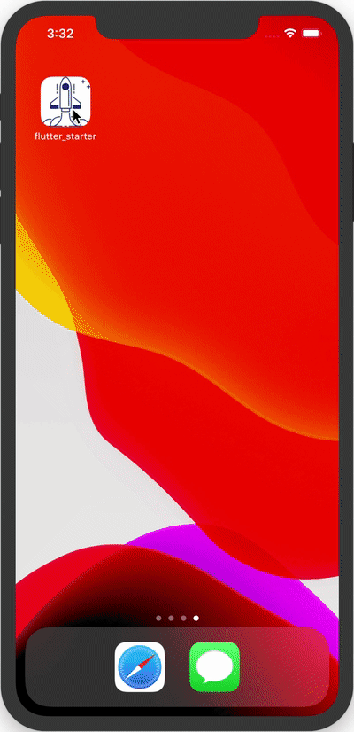 | 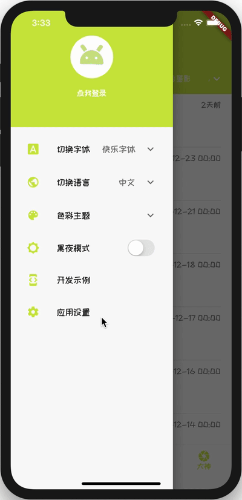 | 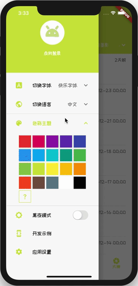 |

| 切换字体 | 切换语言 | 切换主题 |
| :----: | :----: |:----: |
| 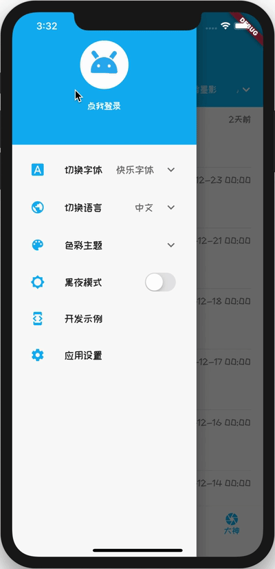 |  | 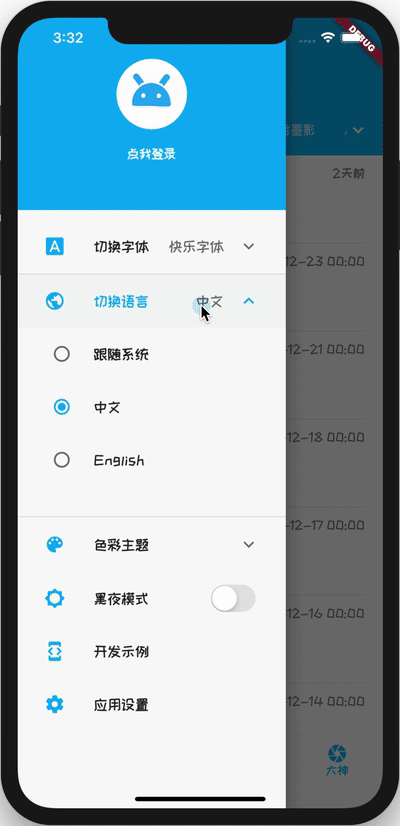 |

| 设置页 | 首页 | 文章详情 |
| :----: | :----: |:----: |
| 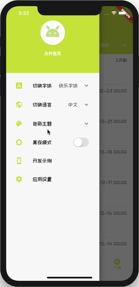 | 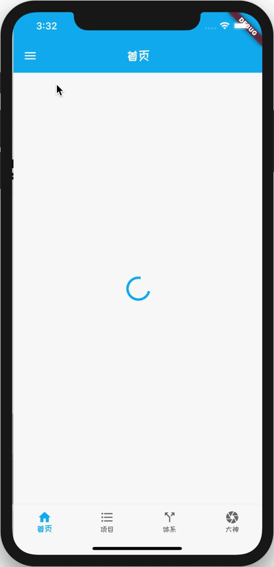 | 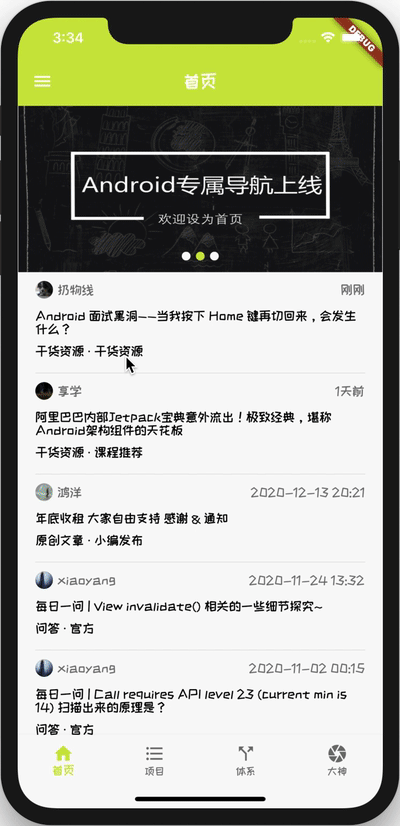 |

| 开发示例 | 开发示例 | 开发示例 |
| :----: | :----: | :----: |
| 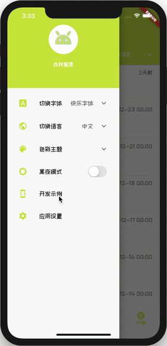 |  |  |

开源不易，麻烦给个Star⭐️吧！我会根据大家的关注度和个人时间持续更新代码！我们一起共同学习进步！

### :file_folder: 四、【工程目录说明】

```
flutter_starter 
├── android<-----------------------原生安卓目录
├── assets<------------------------Flutter资源目录
│  ├── /animations/<---------------动画文件
│  ├── /fonts/<--------------------字体文件
│  └── /images/<-------------------图片文件
├── /docs/<------------------------项目介绍操作文档
├── /ios/<-------------------------原生iOS目录
├── lib
│  |── /api/<----------------------网络交互
│  │── /broadcast/<----------------全局广播（类似EventBus）
│  │── /common/<-------------------框架基础管理
│  |── /generated/<----------------Flutter Intl国际化动态生成目录
│  │── /global_store/<-------------全局状态管理
│  │── /I10n/<---------------------Flutter Intl国际化生成目录存放arb文件
│  |── /page/<---------------------页面
│  │── /route/<--------------------路由管理
│  │── /util/<---------------------工具类
│  └── /widget/<-------------------自定义或者通用的组件
├── pubspec.lock<------------------最终依赖版本
├── pubspec.yaml<------------------Flutter pubspec依赖以及相关配置文件
└── README.md<---------------------Readme
```
### :computer: 五、【关于我】

* **Name**: smarthane
* **Email**: <459121776@qq.com>
* **Description**: Android and J2EE developer

### :sparkle: 六、【感谢】

- [闲鱼提供的非常棒的redux开发框架：fish_redux](https://github.com/alibaba/fish-redux)
- [鸿洋大神的提供的免费接口调用：wan android](https://www.wanandroid.com/)
- [作者phoenixsky非常漂亮的一个玩安卓示例：fun_android_flutter](https://github.com/phoenixsky/fun_android_flutter)

### :computer: 七、【使用开源库】
- [shared_preferences](https://github.com/flutter/plugins/tree/master/packages/shared_preferences)
- [localstorage](https://github.com/lesnitsky/flutter_localstorage)
- [sqflite](https://github.com/tekartik/sqflite)
- [bot_toast](https://github.com/MMMzq/bot_toast/blob/master/README_zh.md)
- [pull_to_refresh](https://github.com/peng8350/flutter_pulltorefresh)
- [flutter_swiper](https://github.com/best-flutter/flutter_swiper/blob/master/README-ZH.md)
- [cached_network_image](https://github.com/Baseflow/flutter_cached_network_image)
- [webview_flutter](https://github.com/flutter/plugins/tree/master/packages/webview_flutter)
- [flutter_webview_plugin](https://github.com/fluttercommunity/flutter_webview_plugin)
- [url_launcher](https://pub.flutter-io.cn/packages/url_launcher)
- [install_plugin](https://github.com/hui-z/flutter_install_plugin)
- [package_info](https://github.com/flutter/plugins/tree/master/packages/package_info)
- [dio](https://github.com/flutterchina/dio)
- [dio_cookie_manager](https://github.com/flutterchina/dio/tree/master/plugins/cookie_manager)
- [cookie_jar](https://github.com/flutterchina/cookie_jar)
- [connectivity](https://github.com/flutter/plugins/tree/master/packages/connectivity)
- [permission_handler](https://github.com/baseflowit/flutter-permission-handler)
- [html_unescape](https://github.com/filiph/html_unescape)
- [flutter_html](https://github.com/Sub6Resources/flutter_html)
- [shimmer](https://github.com/hnvn/flutter_shimmer)
- [lottie](https://github.com/xvrh/lottie-flutter)
- [flutter_local_notifications](https://github.com/MaikuB/flutter_local_notifications)
- [flutter_screenutil](https://github.com/OpenFlutter/flutter_screenutil)

### :computer: 八、【学习资料汇总持续更新中......】
- [Flutter官方网站](https://flutter.dev/)
- [Flutter中文网](https://flutterchina.club/)
- [阿里巴巴咸鱼团队系列文章](https://www.yuque.com/xytech/flutter)
- [阿里巴巴flutter-go](https://github.com/alibaba/flutter-go)
- [字节跳动Flutter架构实践](https://blog.csdn.net/bytedancetech/article/details/103397113)
- [flutter_gallery](https://github.com/flutter/flutter/tree/master/examples/flutter_gallery)
- [flutter-notebook](https://github.com/OpenFlutter/Flutter-Notebook)
- [awesome-flutter](https://github.com/Solido/awesome-flutter)
- [flutter-do](https://github.com/781238222/flutter-do)
- ......
### :flipper: 九、【License】
MIT<br/>
Copyright (c) 2020-present smarthane

